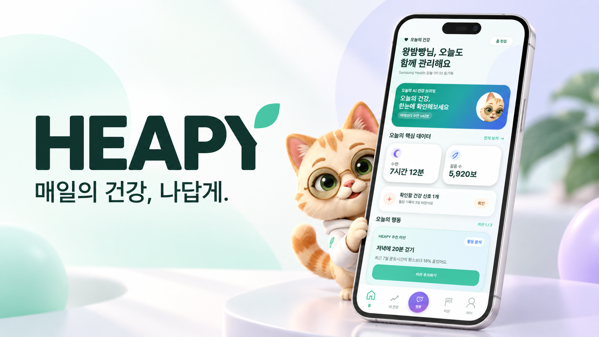
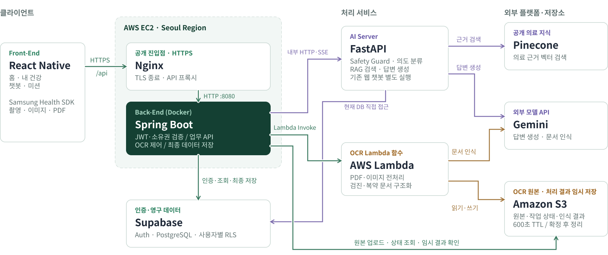
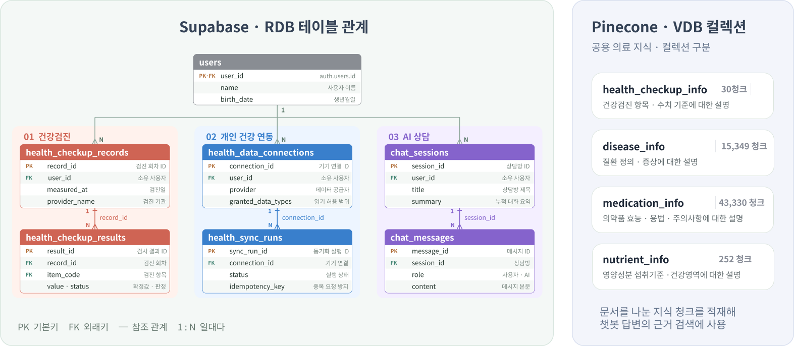

<!-- 작성자: 김진우 -->


<div align="center">

### 나의 건강을 이해하고, 작은 실천을 함께하는 AI 건강 파트너

건강검진과 삼성헬스 기록을 한곳에서 확인하고, AI와 함께 나의 건강 흐름을 이해해요.<br />
맞춤 미션과 복약 알림으로 매일의 건강관리를 이어가세요.

[모바일 앱](https://github.com/Heapy-AI/heapy-frontend) · [백엔드](https://github.com/Heapy-AI/heapy-backend) · [AI 서비스](https://github.com/Heapy-AI/heapy-ai-health)

</div>

---

## 01. Problem & Solution

| 문제 | HEAPY의 해결 방법 |
|---|---|
| 검진 결과지와 생활 기록이 서로 다른 곳에 흩어져 있어 함께 살펴보기 어렵습니다. | 검진 결과 OCR과 삼성헬스 연동으로 기록을 모으고, 영역별 수치와 추이를 제공합니다. |
| 건강 수치가 무엇을 뜻하고 어떤 변화가 있었는지 이해하기 어렵습니다. | 하루 단위 AI 분석과 개인 건강 문맥을 활용한 상담으로 기록을 설명합니다. |
| 건강관리 계획을 세워도 일상 속 실천으로 이어가기 어렵습니다. | 기록 상태에 맞는 미션을 추천하고, 실제 기록으로 진행률을 갱신합니다. |
| 복약 일정과 건강 기록을 따로 챙겨야 합니다. | 처방전·약봉투 OCR, 복약 일정과 푸시 알림을 앱에서 연결합니다. |

---

## 02. Tech Stack

<p align="center">
  
  
  
  
  <br />
  
  
  
  
</p>

---

## 03. Key Features

### 오늘의 건강을 한눈에

홈에서 AI 건강 브리핑, 수면·활동 기록, 복약 일정과 미션을 확인합니다. 사용자는 홈 카드의 표시 여부와 순서를 조정할 수 있습니다.

### 검진과 생활 기록을 함께 관리

건강검진 결과지를 OCR로 등록하고 인식된 내용을 확인·수정한 뒤 저장합니다. 삼성헬스 연동 기록과 직접 입력한 수면·혈압·체성분·물 섭취·혈당을 영역별 그래프로 확인할 수 있습니다.

### 개인 기록을 활용하는 AI 상담과 분석

최근 건강 기록과 검진 정보를 바탕으로 일일 분석을 제공합니다. 챗봇은 개인 건강 문맥과 검색한 공개 지식을 활용하고, 답변을 스트리밍으로 전달합니다.

### 복약 정보 등록과 알림

약봉투·처방전 OCR 또는 직접 입력으로 약과 복용 시간을 등록합니다. 복약 시간이 되면 푸시 알림을 받고 앱에서 일정을 확인할 수 있습니다.

### 개인별 미션과 코디 보상

데이터가 부족하면 기록 확보 미션을, 충분하면 기록에 맞는 수행 미션을 추천합니다. 미션을 완료하면 10코인을 받고, 코디샵에서 의상을 구매해 캐릭터에 착용할 수 있습니다.

### 생활습관 관리 점수

수면과 활동을 중심으로 하루 단위 점수를 산출하고 최근 7일 추이를 제공합니다. 점수는 HEAPY 자체 관리 지표이며 의학적 진단 점수가 아닙니다.

---

## 04. User Flow

```text
회원가입 · 로그인
       ↓
프로필 및 건강 배경 입력
       ↓
삼성헬스 연결 · 건강검진 결과 등록
       ↓
홈 브리핑 · 내 건강 수치와 추이 확인
       ├─ AI 상담으로 궁금한 내용 확인
       ├─ 복약 정보 등록 → 일정 알림 → 복용 확인
       └─ 맞춤 미션 수락 → 건강 기록 / 수행 확인 → 미션 완료
                                                    ↓
                                               10코인 지급
                                                    ↓
                                         의상 구매 → 착용 · 해제
```

---

## 05. Architecture



*발표자료의 아키텍처입니다. 현재 구현에는 분석 결과 캐시를 위한 Redis와 복약 푸시를 위한 Firebase Cloud Messaging도 포함됩니다. 그림의 AI 서버 DB 직접 접근 표시는 기존 웹 데모 경로를 포함하며, 모바일 분석에 필요한 사용자 문맥은 Spring Boot에서 전달합니다.*

모바일 앱의 업무 요청은 Spring Boot를 통해 처리합니다. Spring Boot는 사용자 데이터와 권한을 관리하고, 필요한 건강 문맥을 FastAPI로 전달합니다. FastAPI는 분석·상담을 수행하고, OCR Lambda는 문서 인식을 담당합니다.

| 구성 요소 | 책임 |
|---|---|
| React Native | 화면, 사용자 입력, 삼성헬스 데이터 수집 |
| Spring Boot | 인증·소유권 검증, 업무 규칙, 최종 데이터 저장 |
| FastAPI | AI 분석·상담, 공개 지식 검색 |
| OCR Lambda | 문서 인식과 구조화 |
| PostgreSQL / Redis / Pinecone | 업무 데이터 / 분석 캐시 / 공개 지식 검색을 분리 |

---

## 06. ERD



*발표자료에서 발췌한 핵심 관계도입니다. 전체 스키마가 아니며, 벡터 저장소의 청크 수는 발표자료 작성 시점 기준입니다.*

주요 데이터 영역은 사용자·약관, 건강검진·생활 기록, 상담, 복약·알림, 미션, 코인·상점·옷장입니다. 개인 데이터는 사용자 소유 관계를 기준으로 분리하며, 코인 지급과 사용 이력은 별도 원장으로 추적합니다.

코디샵은 상품(`shop_items`), 구매(`shop_purchases`), 보유 의상(`user_inventory`), 착용 상태(`equipped_items`), 코인 거래 원장(`coin_ledger`)을 분리하여 관리합니다.

---

## 07. Key Highlights

### 업무 데이터와 AI 처리의 책임 분리

Spring Boot가 사용자별 권한과 최종 저장을 담당하고, FastAPI가 AI 생성과 검색을 담당합니다. 공개 건강 지식 검색과 개인 건강 문맥을 구분하며, 개인 건강 기록을 공개 지식 벡터 저장소에 섞지 않습니다.

### 하루 한 번 분석하고 성공 결과는 재사용

한국 시간 기준 일일 분석을 생성하고, 당일 성공 결과를 재사용합니다. 수동 새로고침은 실패한 분석만 재시도하며, DB 상태의 원자적 변경으로 중복 생성을 방지합니다. Redis 캐시와 DB 결과를 함께 사용합니다.

### 동기화와 수동 기록의 출처 구분

삼성헬스에서 수집한 기록과 앱에서 직접 입력한 기록을 구분합니다. 중복 동기화를 제어하고, 기록의 출처에 따라 수정·삭제 가능 범위를 관리합니다.

### OCR 인식과 사용자 확정을 분리

문서를 인식한 결과는 사용자가 검토한 뒤 업무 데이터로 확정합니다. 인식 결과를 바로 최종 기록으로 저장하지 않고, 비동기 작업 상태와 검수 단계를 둡니다.

### 데이터 확보부터 이어지는 미션 추천

추천에 필요한 기록이 부족하면 기록 미션을 우선합니다. 진행 중인 같은 미션의 중복 추천을 방지하고, 완료·거절·중단 이력에 따라 수행 미션의 재추천 시점을 제어합니다.

### 미션 완료·코인·구매의 정합성

미션 완료와 10코인 지급, 구매와 차감·의상 지급을 각각 하나의 트랜잭션으로 처리합니다. 중복 완료와 반복 구매 요청으로 보상이 여러 번 지급되거나 차감되지 않도록 유일 제약과 요청 키를 사용합니다. 코인 원장은 수정 대신 환불 거래를 추가합니다.

---

## 08. Repositories

### 주요 서비스

| 저장소 | 역할 |
|---|---|
| [heapy-frontend](https://github.com/Heapy-AI/heapy-frontend) | React Native 모바일 앱과 삼성헬스 연동, 건강·상담·복약·미션 화면 |
| [heapy-backend](https://github.com/Heapy-AI/heapy-backend) | Spring Boot 업무 API, 인증, 데이터 관리와 알림·미션·코인 처리 |
| [heapy-ai-health](https://github.com/Heapy-AI/heapy-ai-health) | 건강 AI 분석과 상담, 검색 기반 답변 및 분석 데모 |
| [heapy-backend-mission-ui](https://github.com/Heapy-AI/heapy-backend-mission-ui) | 팀원 미션 API·웹 데모와 코디샵 UI 개발 작업물 |

### 연동 및 연구 자료

| 저장소 | 역할 |
|---|---|
| [samsung-health-sdk](https://github.com/Heapy-AI/samsung-health-sdk) | 삼성헬스 SDK 연동과 데이터 추출 연구 |
| [Health-Screening-Record-Classification-Logic](https://github.com/Heapy-AI/Health-Screening-Record-Classification-Logic) | 건강검진 결과 분류 로직 연구 |

<!-- 비공개 및 초기 실험 저장소는 공개 소개 범위를 확인한 뒤 추가한다. -->

---

## 09. Team

<table>
  <tr>
    <td align="center"><a href="https://github.com/chldudtjs05"><br /><b>chldudtjs05</b></a></td>
    <td align="center"><a href="https://github.com/flatcoop24-oss"><br /><b>flatcoop24-oss</b></a></td>
    <td align="center"><a href="https://github.com/Ganjinu21"><br /><b>Ganjinu21</b></a></td>
    <td align="center"><a href="https://github.com/KoSuyeon"><br /><b>KoSuyeon</b></a></td>
  </tr>
</table>

<!-- 이름과 담당 역할은 팀 확인 후 추가한다. -->

